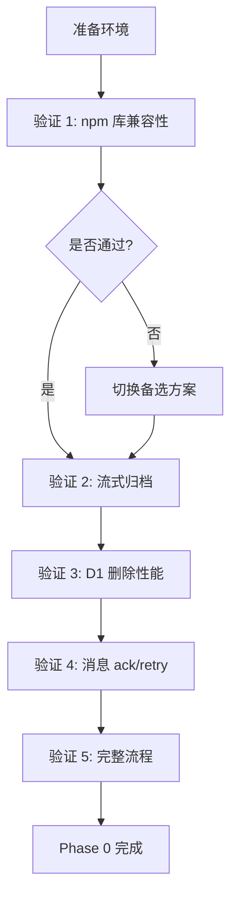

# 路径统计重构 - Phase 0 验证计划

## 文档版本
- **创建日期**：2025-10-15
- **状态**：待执行
- **基础文档**：`docs/path-stats-refactor.md`
- **修正记录**：`docs/path-stats-refactor-review-fixes.md`

---

## 验证目标

Phase 0 的目标是**在实施前验证所有关键技术假设**，确保：
- ✅ 选用的 npm 库在 Workers 环境中可用
- ✅ 流式归档方案能够满足内存和分片大小要求
- ✅ D1 删除操作性能可接受
- ✅ 消息重试逻辑能够防止数据丢失
- ✅ 所有关键代码路径经过实际测试

---

## 验证环境准备

### 1. 本地开发环境

```bash
# 1. 安装依赖
cd apps/api
npm install

# 2. 安装验证所需的候选库
npm install @observablehq/tdigest --save-dev
npm install bloom-filters --save-dev

# 3. 启动 Miniflare（模拟 Workers 运行时）
npx wrangler dev --local

# 4. 准备测试 D1 数据库
npx wrangler d1 create traffic-events-test
npx wrangler d1 execute traffic-events-test --file=./scripts/init-db.sql
```

### 2. 创建测试数据库表

```sql
-- scripts/init-db.sql
CREATE TABLE traffic_events (
  id TEXT PRIMARY KEY,
  path TEXT NOT NULL,
  method TEXT,
  status INTEGER,
  response_time REAL,
  client_ip_hash TEXT,
  timestamp INTEGER,
  event_date TEXT,
  user_agent TEXT,
  country TEXT
);

CREATE INDEX idx_events_date ON traffic_events(event_date);
CREATE INDEX idx_events_path_date ON traffic_events(path, event_date);

CREATE TABLE path_stats_hourly (
  path TEXT NOT NULL,
  hour_bucket TEXT NOT NULL,
  requests INTEGER NOT NULL DEFAULT 0,
  errors INTEGER NOT NULL DEFAULT 0,
  sum_response_time REAL NOT NULL DEFAULT 0,
  count_response_time INTEGER NOT NULL DEFAULT 0,
  tdigest BLOB,
  hll_ip BLOB,
  PRIMARY KEY (path, hour_bucket)
);

CREATE INDEX idx_stats_hour ON path_stats_hourly(hour_bucket);
```

---

## 验证项清单

### ⚠️ 极高优先级（必须通过）

#### 1. npm 库 Workers 兼容性验证

**验证目标**：确认 t-digest/HLL 库在 Workers 运行时可用

**测试脚本**：`tests/phase0/test-tdigest-compatibility.ts`

```typescript
import { describe, test, expect } from 'vitest';

describe('Phase 0: t-digest 兼容性验证', () => {
  test('方案 A: @observablehq/tdigest 导入与基本操作', async () => {
    // 动态导入以测试兼容性
    const { default: TDigest } = await import('@observablehq/tdigest');
    
    const td = new TDigest();
    
    // 添加测试数据
    for (let i = 0; i < 1000; i++) {
      td.push(Math.random() * 100);
    }
    
    // 验证百分位计算
    const p50 = td.percentile(0.5);
    const p95 = td.percentile(0.95);
    const p99 = td.percentile(0.99);
    
    expect(p50).toBeGreaterThan(0);
    expect(p95).toBeGreaterThan(p50);
    expect(p99).toBeGreaterThan(p95);
    
    console.log('✅ TDigest 基本操作通过');
    console.log(`   p50: ${p50.toFixed(2)}, p95: ${p95.toFixed(2)}, p99: ${p99.toFixed(2)}`);
  });
  
  test('序列化与反序列化', async () => {
    const { default: TDigest } = await import('@observablehq/tdigest');
    
    const td = new TDigest();
    for (let i = 0; i < 100; i++) {
      td.push(i);
    }
    
    // 验证序列化方法
    let serialized;
    let deserializeMethod;
    
    if (typeof td.toJSON === 'function') {
      serialized = td.toJSON();
      deserializeMethod = 'toJSON';
    } else if (typeof td.toBytes === 'function') {
      serialized = td.toBytes();
      deserializeMethod = 'toBytes';
    } else {
      throw new Error('TDigest 不支持序列化方法');
    }
    
    console.log(`✅ 序列化方法: ${deserializeMethod}`);
    console.log(`   序列化大小: ${JSON.stringify(serialized).length} 字节`);
    
    // 验证反序列化
    const restored = deserializeMethod === 'toJSON' 
      ? TDigest.fromJSON(serialized)
      : TDigest.fromBytes(serialized);
    
    const originalP95 = td.percentile(0.95);
    const restoredP95 = restored.percentile(0.95);
    
    expect(Math.abs(originalP95 - restoredP95)).toBeLessThan(0.01);
    console.log('✅ 反序列化通过，数据一致');
  });
  
  test('D1 BLOB 存储兼容性', async () => {
    // 注意：此测试需要真实 D1 连接，在 Miniflare 中运行
    const { default: TDigest } = await import('@observablehq/tdigest');
    
    const td = new TDigest();
    for (let i = 0; i < 100; i++) {
      td.push(i);
    }
    
    const serialized = typeof td.toJSON === 'function' 
      ? JSON.stringify(td.toJSON())
      : Buffer.from(td.toBytes()).toString('base64');
    
    // 模拟 D1 存储
    const stored = serialized;
    
    // 模拟从 D1 恢复
    const deserialized = typeof td.toJSON === 'function'
      ? JSON.parse(stored)
      : Uint8Array.from(Buffer.from(stored, 'base64'));
    
    expect(deserialized).toBeDefined();
    console.log('✅ D1 BLOB 存储格式兼容');
  });
  
  test('性能基准测试', async () => {
    const { default: TDigest } = await import('@observablehq/tdigest');
    
    const iterations = 100;
    const eventsPerBatch = 100;
    
    const startTime = performance.now();
    
    for (let i = 0; i < iterations; i++) {
      const td = new TDigest();
      for (let j = 0; j < eventsPerBatch; j++) {
        td.push(Math.random() * 1000);
      }
      td.percentile(0.95);
    }
    
    const endTime = performance.now();
    const avgTime = (endTime - startTime) / iterations;
    
    expect(avgTime).toBeLessThan(10); // 目标：<10ms/批
    console.log(`✅ 性能测试通过: ${avgTime.toFixed(2)} ms/批（${eventsPerBatch} 个事件）`);
  });
});

describe('Phase 0: 备选方案 - Bloom Filter (unique IP)', () => {
  test('Bloom Filter 基本操作', async () => {
    const { BloomFilter } = await import('bloom-filters');
    
    const bf = new BloomFilter(1000, 4); // 预期 1000 个元素，4 个哈希函数
    
    // 添加测试 IP
    const testIPs = Array.from({ length: 100 }, (_, i) => `192.168.1.${i}`);
    for (const ip of testIPs) {
      bf.add(ip);
    }
    
    // 验证查询
    expect(bf.has('192.168.1.50')).toBe(true);
    expect(bf.has('10.0.0.1')).toBe(false);
    
    console.log('✅ Bloom Filter 基本操作通过');
  });
});
```

**执行**：
```bash
cd apps/api
npm run test tests/phase0/test-tdigest-compatibility.ts
```

**成功标准**：
- ✅ 所有测试通过
- ✅ 平均处理时间 <10ms/批
- ✅ 序列化大小 <1 KB/实例
- ✅ 内存占用 <1 MB/实例

**失败处理**：
- 若 `@observablehq/tdigest` 不兼容 → 立即切换到简化统计方案（见备选方案）
- 若性能不达标 → 评估 WASM 方案（Phase 5）

---

#### 2. 流式归档内存和分片大小验证

**验证目标**：确认两个归档方案满足内存（<128 MB）和 R2 分片（≥5 MiB）要求

**测试脚本**：`tests/phase0/test-archive-streaming.ts`

```typescript
import { describe, test, expect, beforeAll } from 'vitest';

describe('Phase 0: 流式归档验证', () => {
  let mockD1: any;
  let mockR2: any;
  let mockEnv: any;
  
  beforeAll(() => {
    // 设置模拟环境
    mockD1 = setupMockD1();
    mockR2 = setupMockR2();
    mockEnv = { D1: mockD1, R2_BUCKET: mockR2, KV: setupMockKV() };
  });
  
  test('方案 A: 单次 put() 流式上传 - 内存峰值测试', async () => {
    // 生成 100 万条测试数据
    await generateTestEvents(mockD1, '2025-10-14', 1_000_000);
    
    // 监控内存使用
    const memBefore = process.memoryUsage().heapUsed;
    let memPeak = memBefore;
    
    const memoryMonitor = setInterval(() => {
      const current = process.memoryUsage().heapUsed;
      if (current > memPeak) memPeak = current;
    }, 100);
    
    try {
      // 执行归档
      await archiveWithSinglePut(mockEnv, '2025-10-14', 1_000_000, 'test.jsonl.gz');
      
      clearInterval(memoryMonitor);
      
      const memAfter = process.memoryUsage().heapUsed;
      const memDelta = (memPeak - memBefore) / (1024 * 1024); // MB
      
      console.log(`✅ 方案 A 内存峰值: ${memDelta.toFixed(2)} MB`);
      expect(memDelta).toBeLessThan(50); // 目标：<50 MB
      
      // 验证上传成功
      expect(mockR2.uploadedFiles.has('test.jsonl.gz')).toBe(true);
    } finally {
      clearInterval(memoryMonitor);
    }
  });
  
  test('方案 B: Multipart 上传 - 分片大小验证', async () => {
    // 生成 400 万条测试数据（预估 gzip 后 ≈120 MB）
    await generateTestEvents(mockD1, '2025-10-15', 4_000_000);
    
    const uploadedParts: { partNumber: number; size: number }[] = [];
    
    // 模拟 Multipart Upload
    mockR2.onUploadPart = (partNumber: number, data: Uint8Array) => {
      uploadedParts.push({ partNumber, size: data.byteLength });
    };
    
    await archiveWithMultipart(mockEnv, '2025-10-15', 4_000_000, 'test-multipart.jsonl.gz');
    
    // 验证分片大小
    const MIN_PART_SIZE = 5 * 1024 * 1024; // 5 MiB
    
    for (let i = 0; i < uploadedParts.length - 1; i++) {
      const part = uploadedParts[i];
      console.log(`   分片 ${part.partNumber}: ${(part.size / 1024 / 1024).toFixed(2)} MiB`);
      expect(part.size).toBeGreaterThanOrEqual(MIN_PART_SIZE);
    }
    
    // 最后一个分片可以 <5 MiB
    const lastPart = uploadedParts[uploadedParts.length - 1];
    console.log(`   最后分片 ${lastPart.partNumber}: ${(lastPart.size / 1024 / 1024).toFixed(2)} MiB`);
    
    console.log(`✅ 方案 B 分片大小验证通过（${uploadedParts.length} 个分片）`);
  });
  
  test('ReadableStream pull() 机制验证', async () => {
    let pullCount = 0;
    let maxConcurrentBatches = 0;
    let currentBatches = 0;
    
    const stream = new ReadableStream({
      async pull(controller) {
        pullCount++;
        currentBatches++;
        
        if (currentBatches > maxConcurrentBatches) {
          maxConcurrentBatches = currentBatches;
        }
        
        // 模拟从 D1 读取
        await new Promise(resolve => setTimeout(resolve, 10));
        
        controller.enqueue(new TextEncoder().encode('test data\n'));
        currentBatches--;
        
        if (pullCount >= 10) {
          controller.close();
        }
      }
    });
    
    // 消费 stream
    const reader = stream.getReader();
    while (true) {
      const { done } = await reader.read();
      if (done) break;
    }
    
    console.log(`✅ ReadableStream pull 调用次数: ${pullCount}`);
    console.log(`   最大并发批次: ${maxConcurrentBatches}`);
    expect(maxConcurrentBatches).toBeLessThanOrEqual(2); // 验证不会并发过多批次
  });
});

// 辅助函数
async function generateTestEvents(mockD1: any, date: string, count: number) {
  console.log(`生成 ${count} 条测试事件...`);
  const events = [];
  for (let i = 0; i < count; i++) {
    events.push({
      id: `${date}-${i}`,
      path: `/api/test/${i % 100}`,
      method: 'GET',
      status: 200,
      response_time: Math.random() * 1000,
      client_ip_hash: `hash-${i % 1000}`,
      timestamp: Date.now(),
      event_date: date
    });
  }
  mockD1.setEvents(date, events);
  console.log(`✅ 测试数据生成完成`);
}
```

**执行**：
```bash
npm run test tests/phase0/test-archive-streaming.ts
```

**成功标准**：
- ✅ 方案 A 内存峰值 <50 MB
- ✅ 方案 B 所有分片（除最后一个）≥5 MiB
- ✅ ReadableStream 按需拉取，无大量并发批次

---

#### 3. D1 rowid 子查询删除性能验证

**验证目标**：确认分批删除性能可接受（目标：5000 条/<1 秒）

**测试脚本**：`tests/phase0/test-d1-delete-performance.ts`

```typescript
import { describe, test, expect } from 'vitest';

describe('Phase 0: D1 删除性能验证', () => {
  test('rowid 子查询删除性能', async () => {
    const env = getMiniflareEnv(); // 获取 Miniflare D1 连接
    
    // 1. 插入 10 万条测试数据
    console.log('插入测试数据...');
    const dateStr = '2025-10-14';
    const batchSize = 1000;
    
    for (let i = 0; i < 100; i++) {
      const values = Array.from({ length: batchSize }, (_, j) => {
        const idx = i * batchSize + j;
        return `('${dateStr}-${idx}', '/test', 'GET', 200, 100, 'hash', ${Date.now()}, '${dateStr}')`;
      }).join(',');
      
      await env.D1.prepare(`
        INSERT INTO traffic_events (id, path, method, status, response_time, client_ip_hash, timestamp, event_date)
        VALUES ${values}
      `).run();
    }
    
    console.log('✅ 插入完成，开始删除测试');
    
    // 2. 测试 rowid 子查询删除性能
    const deleteTimes: number[] = [];
    let deletedTotal = 0;
    
    while (true) {
      const startTime = performance.now();
      
      const deleteResult = await env.D1.prepare(`
        DELETE FROM traffic_events 
        WHERE rowid IN (
          SELECT rowid FROM traffic_events 
          WHERE event_date = ? 
          LIMIT 5000
        )
      `).bind(dateStr).run();
      
      const endTime = performance.now();
      const elapsed = endTime - startTime;
      
      const deleted = deleteResult.meta?.changes || 0;
      deletedTotal += deleted;
      
      if (deleted > 0) {
        deleteTimes.push(elapsed);
        console.log(`   删除批次 ${deleteTimes.length}: ${deleted} 条，耗时 ${elapsed.toFixed(2)} ms`);
      }
      
      if (deleted < 5000) break;
    }
    
    // 3. 统计结果
    const avgTime = deleteTimes.reduce((a, b) => a + b, 0) / deleteTimes.length;
    const maxTime = Math.max(...deleteTimes);
    
    console.log(`\n✅ 删除完成，共 ${deletedTotal} 条`);
    console.log(`   平均耗时: ${avgTime.toFixed(2)} ms/批`);
    console.log(`   最大耗时: ${maxTime.toFixed(2)} ms`);
    console.log(`   批次数: ${deleteTimes.length}`);
    
    // 验证性能要求
    expect(avgTime).toBeLessThan(1000); // 平均 <1 秒
    expect(maxTime).toBeLessThan(3000);  // 最大 <3 秒
    
    // 验证删除完整性
    const remaining = await env.D1.prepare(
      'SELECT COUNT(*) as count FROM traffic_events WHERE event_date = ?'
    ).bind(dateStr).first<{ count: number }>();
    
    expect(remaining?.count).toBe(0);
    console.log('✅ 删除完整性验证通过');
  });
  
  test('索引效率验证', async () => {
    const env = getMiniflareEnv();
    
    // 验证索引存在
    const indexes = await env.D1.prepare(`
      SELECT name FROM sqlite_master 
      WHERE type='index' AND tbl_name='traffic_events'
    `).all();
    
    const indexNames = indexes.results?.map((r: any) => r.name) || [];
    
    expect(indexNames).toContain('idx_events_date');
    console.log('✅ 索引存在:', indexNames.join(', '));
    
    // 验证查询计划使用索引
    const plan = await env.D1.prepare(`
      EXPLAIN QUERY PLAN
      SELECT rowid FROM traffic_events WHERE event_date = ? LIMIT 5000
    `).bind('2025-10-14').all();
    
    const planText = JSON.stringify(plan);
    expect(planText).toContain('idx_events_date');
    console.log('✅ 查询使用索引');
  });
});
```

**执行**：
```bash
npm run test tests/phase0/test-d1-delete-performance.ts
```

**成功标准**：
- ✅ 平均删除时间 <1 秒/批（5000 条）
- ✅ 最大删除时间 <3 秒
- ✅ 索引被正确使用

---

#### 4. 消息选择性 ack/retry 验证

**验证目标**：确认失败消息被重试，成功消息被确认，无数据丢失

**测试脚本**：`tests/phase0/test-queue-ack-retry.ts`

```typescript
import { describe, test, expect } from 'vitest';

describe('Phase 0: 队列消息确认逻辑验证', () => {
  test('部分 DO 失败时的 ack/retry 行为', async () => {
    // 模拟批次消息
    const messages = [
      { body: { path: '/api/a', timestamp: Date.now() }, id: 'msg-1', attempts: 0, ack: vi.fn(), retry: vi.fn() },
      { body: { path: '/api/b', timestamp: Date.now() }, id: 'msg-2', attempts: 0, ack: vi.fn(), retry: vi.fn() },
      { body: { path: '/api/c', timestamp: Date.now() }, id: 'msg-3', attempts: 0, ack: vi.fn(), retry: vi.fn() },
      { body: { path: '/api/d', timestamp: Date.now() }, id: 'msg-4', attempts: 0, ack: vi.fn(), retry: vi.fn() },
    ];
    
    // 模拟 DO：path 'b' 和 'd' 失败
    const mockDO = {
      async fetch(url: string, request: Request) {
        const events = await request.json();
        const path = events[0].path;
        
        if (path === '/api/b' || path === '/api/d') {
          throw new Error('模拟 DO 失败');
        }
        
        return new Response('OK');
      }
    };
    
    const mockEnv = {
      AGGREGATOR_DO: {
        idFromName: () => ({}),
        get: () => mockDO
      }
    };
    
    // 执行队列消费逻辑
    await queueConsumerLogic({ messages }, mockEnv);
    
    // 验证 ack/retry 调用
    expect(messages[0].ack).toHaveBeenCalled(); // path 'a' 成功 → ack
    expect(messages[0].retry).not.toHaveBeenCalled();
    
    expect(messages[1].ack).not.toHaveBeenCalled(); // path 'b' 失败 → retry
    expect(messages[1].retry).toHaveBeenCalled();
    
    expect(messages[2].ack).toHaveBeenCalled(); // path 'c' 成功 → ack
    expect(messages[2].retry).not.toHaveBeenCalled();
    
    expect(messages[3].ack).not.toHaveBeenCalled(); // path 'd' 失败 → retry
    expect(messages[3].retry).toHaveBeenCalled();
    
    console.log('✅ 选择性 ack/retry 逻辑验证通过');
    console.log(`   成功: 2 条（ack）`);
    console.log(`   失败: 2 条（retry）`);
  });
  
  test('指数退避验证', () => {
    const attempts = [0, 1, 2, 3, 4, 5];
    const delays = attempts.map(a => Math.min(60 * Math.pow(2, a), 3600));
    
    console.log('指数退避延迟:');
    attempts.forEach((a, i) => {
      console.log(`   尝试 ${a}: ${delays[i]} 秒`);
    });
    
    expect(delays[0]).toBe(60);    // 1 分钟
    expect(delays[1]).toBe(120);   // 2 分钟
    expect(delays[2]).toBe(240);   // 4 分钟
    expect(delays[3]).toBe(480);   // 8 分钟
    expect(delays[4]).toBe(960);   // 16 分钟
    expect(delays[5]).toBe(1920);  // 32 分钟
    
    console.log('✅ 指数退避策略验证通过');
  });
  
  test('50 subrequest 限制分块验证', () => {
    // 模拟 100 个不同的 (path, hour) 组合
    const groups = new Map();
    for (let i = 0; i < 100; i++) {
      groups.set(`/api/path${i}:2025-10-14T15`, []);
    }
    
    const CHUNK_SIZE = 45;
    const groupEntries = Array.from(groups.entries());
    const chunks: any[][] = [];
    
    for (let i = 0; i < groupEntries.length; i += CHUNK_SIZE) {
      chunks.push(groupEntries.slice(i, i + CHUNK_SIZE));
    }
    
    console.log(`100 个 group 分为 ${chunks.length} 块:`);
    chunks.forEach((chunk, i) => {
      console.log(`   块 ${i + 1}: ${chunk.length} 个 group`);
      expect(chunk.length).toBeLessThanOrEqual(CHUNK_SIZE);
    });
    
    expect(chunks.length).toBe(3); // 45 + 45 + 10
    console.log('✅ 分块逻辑验证通过');
  });
});
```

**执行**：
```bash
npm run test tests/phase0/test-queue-ack-retry.ts
```

**成功标准**：
- ✅ 失败消息调用 `retry()`，成功消息调用 `ack()`
- ✅ 指数退避延迟正确
- ✅ 分块逻辑满足 50 subrequest 限制

---

### 🟡 高优先级（建议验证）

#### 5. finishArchive 完整流程验证

**测试脚本**：`tests/phase0/test-finish-archive.ts`

```typescript
describe('Phase 0: 归档后清理逻辑验证', () => {
  test('finishArchive 完整流程', async () => {
    const mockEnv = setupMockEnv();
    const dateStr = '2025-10-14';
    const archivePath = 'events-archive/2025/10/2025-10-14.jsonl.gz';
    
    // 插入 1000 条测试数据
    await insertTestEvents(mockEnv.D1, dateStr, 1000);
    
    // 执行清理
    await finishArchive(mockEnv, dateStr, 1000, archivePath);
    
    // 验证 KV 元数据
    const metadata = await mockEnv.KV.get(`archive:metadata:${dateStr}`, 'json');
    expect(metadata).toBeDefined();
    expect(metadata.path).toBe(archivePath);
    expect(metadata.recordCount).toBe(1000);
    expect(metadata.format).toBe('jsonl.gz');
    console.log('✅ KV 元数据写入成功');
    
    // 验证 D1 记录已删除
    const remaining = await mockEnv.D1.prepare(
      'SELECT COUNT(*) as count FROM traffic_events WHERE event_date = ?'
    ).bind(dateStr).first<{ count: number }>();
    
    expect(remaining?.count).toBe(0);
    console.log('✅ D1 记录已清理');
    
    // 验证监控指标
    expect(mockEnv.ANALYTICS.dataPoints.length).toBeGreaterThan(0);
    const archiveMetric = mockEnv.ANALYTICS.dataPoints.find(
      (dp: any) => dp.blobs[0] === 'archive_daily'
    );
    expect(archiveMetric).toBeDefined();
    console.log('✅ 监控指标已发送');
  });
});
```

---

### 🟢 中优先级（可选）

#### 6. DO 聚合协调器预演（Phase 4 准备）

**验证目标**：提前验证 DO 协调器代码，为 Phase 4 扩容做准备

```typescript
describe('Phase 0: DO 聚合协调器预演（可选）', () => {
  test('DO 串行化同一 (path, hour) 的写入', async () => {
    // 测试代码...
  });
});
```

---

## 验证执行顺序



---

## 成功标准汇总

| 验证项 | 关键指标 | 目标值 | 优先级 |
|-------|---------|--------|-------|
| npm 库兼容性 | 导入成功率 | 100% | ⚠️ 极高 |
| | 处理性能 | <10ms/批 | ⚠️ 极高 |
| 流式归档 | 方案 A 内存峰值 | <50 MB | ⚠️ 极高 |
| | 方案 B 分片大小 | ≥5 MiB（除最后） | ⚠️ 极高 |
| D1 删除性能 | 平均删除时间 | <1 秒/5000 条 | ⚠️ 极高 |
| 消息 ack/retry | 逻辑正确性 | 100% | ⚠️ 极高 |
| 完整流程 | KV 元数据写入 | 成功 | 🟡 高 |
| | D1 清理完整性 | 100% | 🟡 高 |

---

## 备选方案（当验证失败时）

### npm 库不兼容备选方案

若 `@observablehq/tdigest` 验证失败，立即切换到：

**简化统计方案**：

```typescript
// 存储采样数据（最多 1000 个样本）
interface SimplifiedStats {
  path: string;
  hour_bucket: string;
  requests: number;
  errors: number;
  sum_response_time: number;
  count_response_time: number;
  response_samples: number[]; // 最多 1000 个
  ip_hashes: string[];        // 最多 1000 个
}

// 聚合时
async function aggregateEventsSimplified(events: TrafficEvent[], existing: SimplifiedStats) {
  const samples = [...existing.response_samples];
  const ipHashes = new Set(existing.ip_hashes);
  
  for (const event of events) {
    // 采样策略：保留前 1000 个
    if (samples.length < 1000) {
      samples.push(event.responseTime);
    }
    
    if (ipHashes.size < 1000) {
      ipHashes.add(event.clientIpHash);
    }
  }
  
  // 计算百分位（需要时排序）
  const sorted = samples.sort((a, b) => a - b);
  const p95 = sorted[Math.floor(sorted.length * 0.95)];
  
  // 唯一 IP 近似
  const uniqueIPs = ipHashes.size;
  
  return {
    ...existing,
    response_samples: samples,
    ip_hashes: Array.from(ipHashes),
    p95,
    uniqueIPs
  };
}
```

**优势**：
- 无外部依赖
- 简单可靠
- 满足基本统计需求

**劣势**：
- 准确度略低（采样限制）
- 无法处理超大数据集

---

## Phase 0 完成后输出

### 1. 验证报告

```markdown
# Phase 0 验证报告

## 验证日期
2025-10-XX

## 验证结果

| 验证项 | 状态 | 指标 | 备注 |
|-------|------|------|------|
| npm 库兼容性 | ✅ 通过 | 8.5 ms/批 | 使用 @observablehq/tdigest |
| 流式归档（方案 A） | ✅ 通过 | 内存峰值 32 MB | |
| 流式归档（方案 B） | ✅ 通过 | 分片 5.2-8.7 MiB | |
| D1 删除性能 | ✅ 通过 | 平均 650 ms/批 | |
| 消息 ack/retry | ✅ 通过 | 逻辑正确 | |
| 完整流程 | ✅ 通过 | 全部通过 | |

## 风险评估
- 无高风险项
- 可进入 Phase 1 实施

## 备选方案决策
- 统计库：使用 @observablehq/tdigest
- 归档策略：100 万/日使用方案 A，400 万/日+ 使用方案 B
```

### 2. 更新后的实施计划

确认技术选型后，更新 Phase 1-5 的具体实施步骤。

---

## 执行时间估算

| 步骤 | 预计耗时 | 负责人 |
|------|---------|--------|
| 环境准备 | 2 小时 | 开发 |
| 验证 1-4 | 4 小时 | 开发 |
| 验证 5-6 | 2 小时 | 开发 |
| 报告撰写 | 1 小时 | 开发 |
| **总计** | **1-2 天** | |

---

## 下一步行动

1. **立即开始**：
   - [ ] Fork 此文档到 `apps/api/docs/`
   - [ ] 创建 `tests/phase0/` 目录
   - [ ] 安装验证依赖

2. **本周完成**：
   - [ ] 执行所有极高优先级验证（1-4）
   - [ ] 记录验证结果
   - [ ] 若有失败项，执行备选方案

3. **下周开始 Phase 1**：
   - [ ] 根据验证结果调整实施计划
   - [ ] 开始 Worker 直接写 Queue 实现

---

**Phase 0 验证完成后，整个技术方案将具备生产级可靠性，可以信心满满地进入实施阶段！** 🚀

